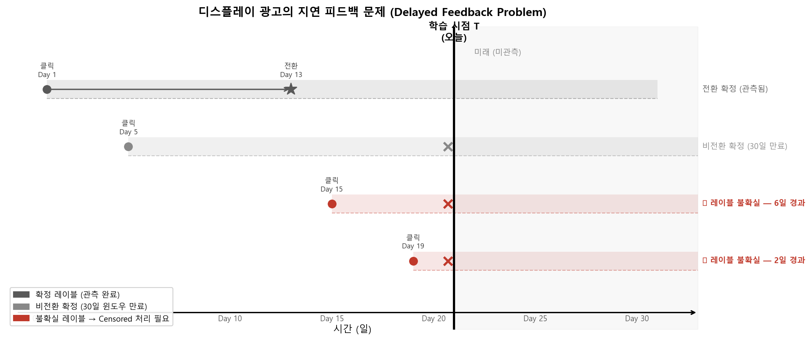
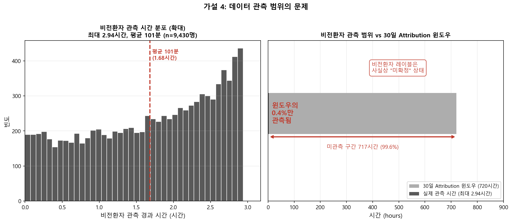
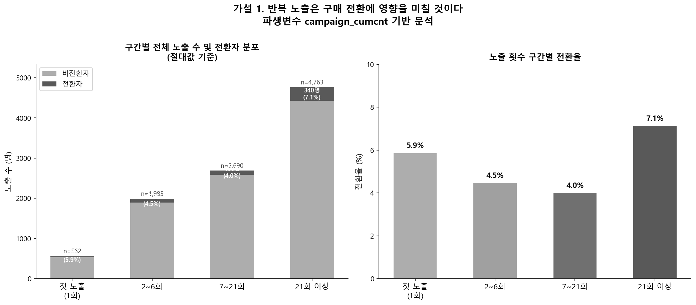
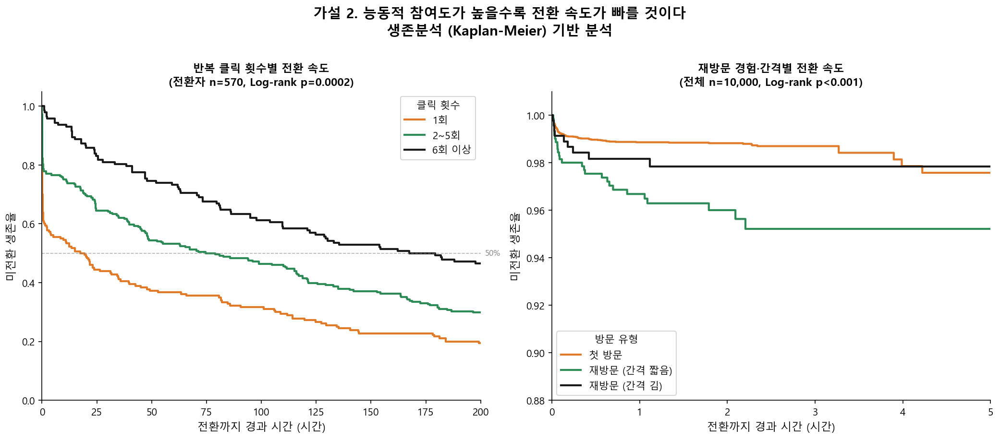
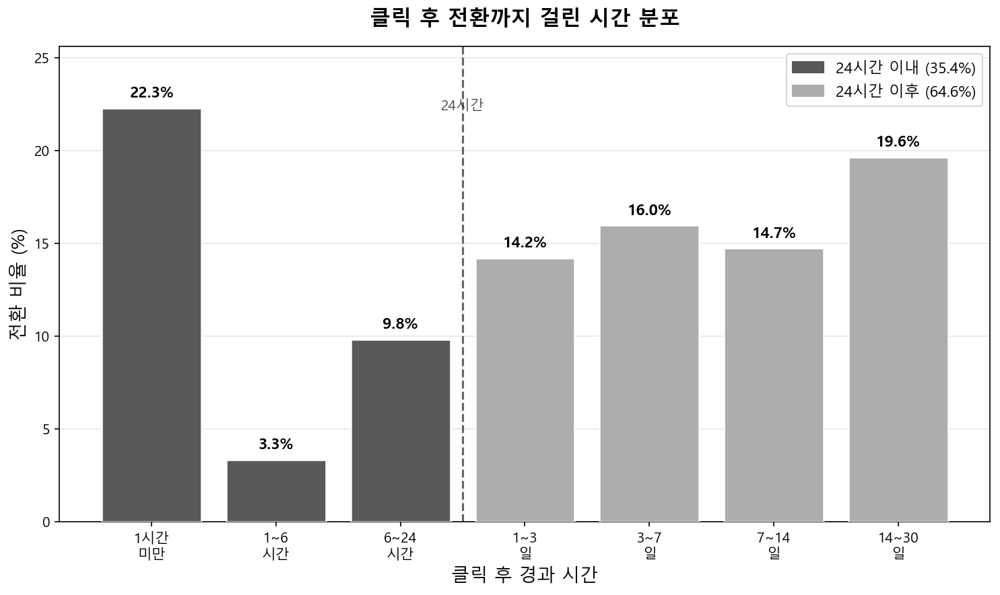
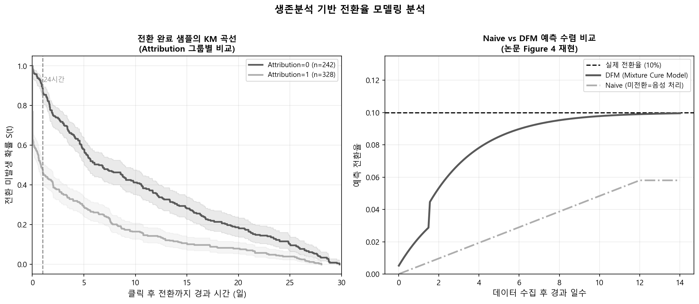
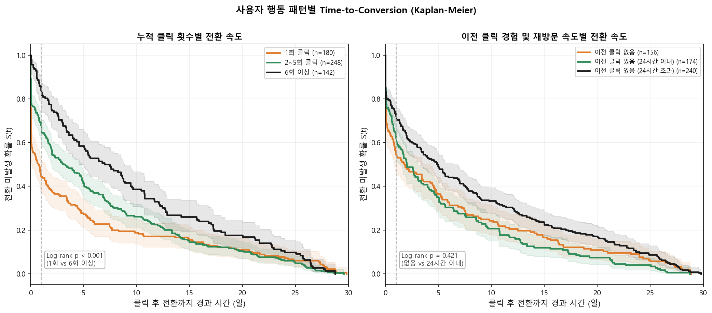
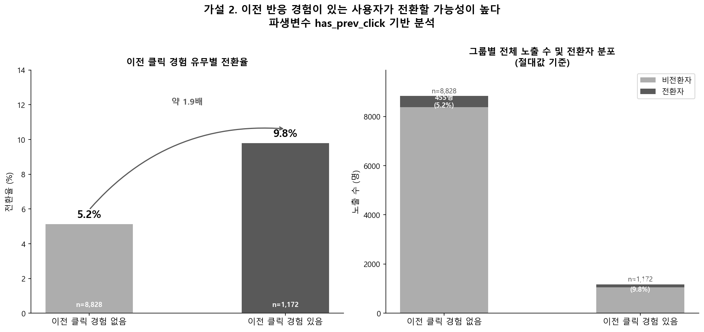

# 광고 전환율 모델링과 지연 피드백 생존분석

> **Ca' Foscari University of Venice — Statistical Inference and Learning**  
> 장윤서 · 2026.01

---

## 문제 정의

**"광고비는 쓰는데, 어떤 광고의 노출이 실제 구매로 이어지는가?"**



온라인 광고에서 전환(구매)은 클릭 직후 일어나지 않습니다.

- 전환자의 **64.6%는 클릭 후 24시간 이후에 구매** 발생
- 비전환자의 최대 관측 시간은 **2.94시간** — 30일 윈도우의 0.4%만 관측
- **비전환자는 안 산 게 아니라, 아직 안 샀을 수 있다**

이 지연 피드백(Delayed Feedback) 문제를 무시하면, 비전환자를 미전환(아직 구매 안 함)과 비구매로 혼동하게 됩니다.

---

## 데이터

| 항목 | 내용 |
|------|------|
| **출처** | Criteo 온라인 광고 클릭 로그 |
| **규모** | 10,000 관측치, 22개 변수 |
| **구조** | 노출(Impression) → 클릭(Click) → 전환(Conversion) |
| **분할** | 시계열 특성 고려, 70/30 시간순 분할 |

**파생변수 설계**
- `campaign_curcnt` — 광고 ID별 누적 노출 횟수 (반복 노출 효과 측정)
- `has_prev_click` — 이전 광고 클릭 경험 유무

---

## 가설 및 분석 방법론



### 가설 1. 광고의 반복된 노출은 구매 전환율에 영향을 미친다
- `campaign_curcnt` 구간별 분류 (첫 노출 / 2~6회 / 7~21회 / 21회 이상)
- 구간별 전환율 비교 분석



### 가설 2. 사용자 행동 패턴에 따라 구매 전환 속도가 달라진다
- 클릭 횟수 / 재방문 간격 기반 그룹 분류
- **KM 생존분석**으로 그룹 간 전환 속도 비교



---

## 분석 파이프라인

```
Criteo 데이터
  ↓ EDA — CTR/CVR 분포, 변수 탐색
  ↓ 시계열 기준 Train/Test 분할 (70/30)
  ↓ CTR 모델링 — 로지스틱 회귀 (클릭 예측)
  ↓ CVR 모델링 — 로지스틱 회귀 (전환 예측)
  ↓ Delayed Feedback 생존분석
      ├── Kaplan-Meier — 전환 지연 시간 분포 시각화
      ├── Cox PH 모델 — 전환 시점에 영향 미치는 변수 분석
      └── AFT 모델 — Exponential · Weibull · Log-normal · Log-logistic 비교
  ↓ Logistic Regression 교차 검증 — 가설 분석 결과와 비교
```

---

## 주요 시각화

<table>
  <tr>
    <td></td>
    <td></td>
  </tr>
  <tr>
    <td></td>
    <td></td>
  </tr>
</table>

---

## 파일 구성

| 파일 | 내용 |
|------|------|
| `Yunseo Chang_Project.Rmd` | 메인 분석 보고서 (R Markdown) |
| `project.R` | 탐색적 분석 스크립트 |
| `modeling1.R` | CTR / CVR 로지스틱 회귀 |
| `modeling2.R` | 생존분석 (KM · Cox PH · AFT) |
| `images/` | 분석 시각화 결과물 |

---

## 사용 라이브러리

```r
library(readr); library(dplyr); library(ggplot2)
library(boot); library(pROC); library(car)
library(margins); library(effects)
library(survival)   # KM · Cox PH · AFT
```
